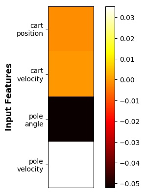

# Differential Integrated Gradient

This is the implementation of the differential saliency method used in "[Understanding Finite-State Representations of Recurrent Policy Networks](https://arxiv.org/abs/2006.03745)", accepted to the *Extending Explainable AI Beyond Deep Models and Classifiers* workshop at the *International Conference on Machine Learning* **(ICML)** 2020. 

## Installation
* Python 3.5+
* To install dependencies:
    ```bash
    pip install -r requirements.txt
    ```

## Usage
You can use ```main_IG.py``` or ```main_IG_control.py``` for experimenting with Atari and Control Tasks from OpenAI Gym.

To begin, you  need to load and use models trained here: [MMN](https://github.com/koulanurag/mmn). Once you took all the steps, you end up with a MMN model, and that's what is needed in this repo. Trained models should be put into the ```inputs``` directory with a proper name.

Having the models, it's time to run the code. To do that, just run the following command to get the results for Atari games:
```
python main_IG.py --env_type=atari --input_index=43 --baseline_index=103 --env PongDeterministic-v4 --qbn_sizes 64 100 --gru_size 32
```
Values of the input arguments can be changed according to your interest.

And the following command to get the results for control tasks:
```
python main_IG_control.py --env_type=classic_control --input_index=10 --baseline_index=106 --env CartPole-v1 --qbn_sizes 4 4 --gru_size 32
```

Results will be saved into the ```results``` folder. In the repo, we have already provided sample results. For example, in the case of CartPole, an output will look like the following:
<p align="center">
  
</p>

## Citation
If you find it useful in your research, please cite it with:
```
@article{danesh2020understanding,
  title={Understanding Finite-State Representations of Recurrent Policy Networks},
  author={Danesh, Mohamad H and Koul, Anurag and Fern, Alan and Khorram, Saeed},
  journal={arXiv preprint arXiv:2006.03745},
  year={2020}
}
```